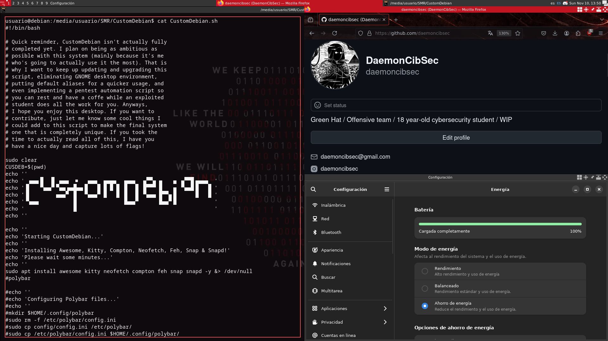

# CustomDebian - Customizable Pentesting Debian Script

## Overview

CustomDebian is an script that provides a productive, efficient and customizable Debian for anyone interested in penetration testing and cibersecurity. The project started as an idea of creating my own distribution, but before committing to something so ambitious, I had to start learning more about Debian and how it works, so first off, I'm starting with a basic script with some tools I use to practice and learn more about cybersecurity, so I hope you guys can learn as well.

## Installation

Requisites: Having GNOME installed (not yet tested with other desktop environments)

```bash
git clone https://github.com/daemoncibsec/CustomDebian.git
cd CustomDebian/
chmod +x CustomDebian.sh
```

## Starting the script

```bash
./CustomDebian.sh
```

### Setting up some tools

- `msfconsole`: Sets up metasploit

## Desktop preview



### Tools included

Tools used:
- OpenVPN - [OpenVPN](https://openvpn.net/client/)
- Kali-anonsurf - [Kali-anonsurf](https://github.com/Und3rf10w/kali-anonsurf)
- Moxie - [Moxie](https://github.com/aravind0x7/Moxie/tree/main)
- Mosquitto - [Mosquito](https://mosquitto.org/)
- Nmap - [Nmap](https://nmap.org/)
- Wfuzz - [Wfuzz](https://github.com/xmendez/wfuzz)
- Gobuster - [Gobuster](https://github.com/OJ/gobuster)
- Curl - [Curl](https://curl.se/docs/manpage.html)
- Metasploit - [Metasploit](https://www.metasploit.com/)

## Credits

- Created by [daemoncibsec](https://https://www.instagram.com/daemoncibsec/)
- Awesome Window Manager - [Awesome](https://awesomewm.org/)
- Terminal - [Kitty Terminal](https://sw.kovidgoyal.net/kitty/)
